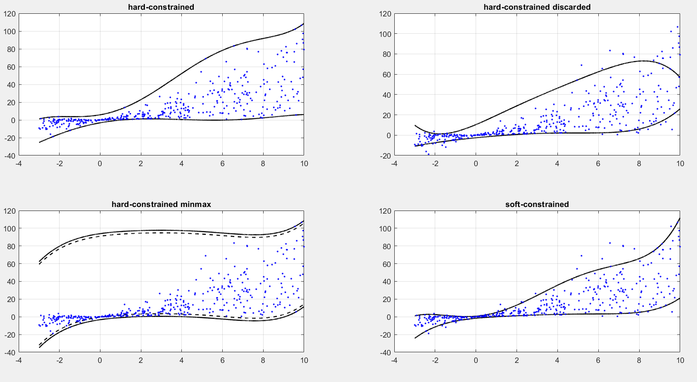

#  Interval Predictor Model

[](https://doi.org/10.5281/zenodo.4678150)
[](https://nl.mathworks.com/matlabcentral/fileexchange/90227-interval-predictor-models-and-genreralization-error-bounds)

Cite as:

[] Roberto Rocchetta, Qi Gao, Milan Petkovic, “Soft-constrained interval predictor models and epistemic reliability intervals: A new tool for uncertainty quantification with limited experimental data” Mechanical Systems and Signal Processing, Vol 161, 2021, 107973.
 
> doi:  https://doi.org/10.1016/j.ymssp.2021.107973


``` bibtex
@article{ROCCHETTA2021107973,
title = {Soft-constrained interval predictor models and epistemic reliability intervals: A new tool for uncertainty quantification with limited experimental data},
journal = {Mechanical Systems and Signal Processing},
volume = {161},
pages = {107973},
year = {2021},
issn = {0888-3270},
doi = {https://doi.org/10.1016/j.ymssp.2021.107973},
url = {https://www.sciencedirect.com/science/article/pii/S088832702100368X},
author = {Roberto Rocchetta and Qi Gao and Milan Petkovic}
}
```


An Interval Predictor Model (IPM) offers an interval-valued characterization of the uncertainty affecting the a process.
This repository presents a matlab class to optimized the bounding functions defining an IPM.
The reliability of the optmized predictor (probability that future samples will fall outside from the predictive bounds) is formally bounded thanks to scenario theory

<p align="center">
  
</p>
 
 
```
   an IPM is a rule I(x;theta) which assign to an input x an interval for a dependent quantity y.
    two bounding functions deinfe
    
    I(x;theta)=[fl(x;theta);fu(x;theta)]
    
    where \theta are the fitting coefficients to be optimized and,
    fl(x;theta) is a linear combination of \theta and basis functions. 
```    
```
   An IPM is built given-data by imposing a sample constrains on the IPM bounds.
   The samples constraiints are deifined by N samples of the proces:
   D_{N}={(x1,y1),(x2,y2),..., (xN,yN)} 
   where (x_t, y_t) are assumed independent and identically distributed. 
```
##  Different methods are available in this class to optimize I(x;theta)
### 1) full-data enclosure (no exeption) and minimization of the area between the bounding functions

    %    min_{\theta} Area(theta) s.t.
    %    f_u(xi;theta)>=y_i and  f_l(xi;theta)<=y_i for all i=1,..,D_{N}
    %    f_u(x;theta)>=f_l(x;theta) for all x (up bound dominance)
    
### 2) discard No samples from the data base D_{N} and minimization of the area for the remaining scenarios
    
    %    min_{\theta} Area(theta) s.t.
    %    f_u(xi;theta)>=y_i and  f_l(xi;theta)<=y_i for all i in D_{N-No}
    %    f_u(x;theta)>=f_l(x;theta) for all x (up bound dominance)
    
### 3) Minimax layer IPM: minimizes the maximum distance between a regression function and the samples y_i

    min_{\theta} max_{i=1,..,N} |f_reg(x_i;theta)-y_i|
     f_u(x;theta)>=f_l(x;theta) for all x (up bound dominance)
    
### 4) Soft-constrained IPM: minizes a combination of area metric and cost of violations given by a parameter rho>0
     
     min_{\theta} Area(theta)+rho \sum_{i=1}^N \zeta_i s.t.
     f_u(xi;theta)>=y_i-\zeta_i and  f_l(xi;theta)<=y_i-\zeta_i for all x_i,y_i \in D_{N}
     \zeta_i>=0 for i=1,...,N  (slack variables)
     f_u(x;theta)>=f_l(x;theta) for all x (up bound dominance)
    
  <p align="center">
  
</p>
      
### 5) CVaR method (To be updated)

     min_{\theta} Area(theta)
     s.t.    f_u(xi;theta)>=CVAR(y_i,alpha) for all i=1,..,D_{N}
            f_l(xi;theta)<=CVAR(y_i,1-alpha) for all i=1,..,D_{N}
    
   

   
### A simple Example :
  ```
  %inputs 
  
    Xdn vector of explanatory variables (1-Dimensional [1xNsamples])
    Ydn vector of dependent variables (1-Dimensional [1xNsamples])
   % OUTPUTS: a structure named Design containing the following fields
    
     Design.Area: The area betweeen the optimized (accuracy)
     Design.OptTheta: optimized fitting coefficients defining the bounds
     Design.Generalization: Compelxity of the solution and other
     propreties needed to evaluate scenario-based reliabiity/error bounds
```

### How to use? A simple example 
```Matlab
% Generate scenarios 
Nsamples=400;
X=unifrnd(-3,10,[1,Nsamples]);
Y= (X.*rand([1,Nsamples])).^2+X.*exprnd(2,[1,Nsamples]);


% prepare IPM object
Xsupport=[min(X),max(X)];
Ysupport=[min(Y),max(Y)];
options=optimoptions('fmincon','MaxIterations',1e3,'ConstraintTolerance',1e-4,...
    'StepTolerance',1e-6,'MaxFunctionEvaluations',1e4,...
    'Display','iter','Algorithm','sqp');

IPM=IPM_Model('degreeup', 6,'degreelow',6 ,...
    'basis','poly', 'Length',[],...
    'Xsup',Xsupport, 'Ysup',Ysupport,'options',options);
    
    
%% %% %%  %% %% %% %%  %%  1) hard-constrained solver %% %% %%  %% %% %% %%  %% 

%% %% %%  %% Reliability bounds ( A-priori )
beta_target=10^-5;
Ndiscarded=0; % number of discarded samples
Nd=12; %  number of optimization variables 
epsilon_apriori=getepsilon_ConvexDiscard(Nsamples,beta_targ,Ndiscarded,Nd) 
RelBound_apriori=[1-epsilon_apriori,1];

%% optimize the model
Design=IPM.DesingIPM_hard_constrained_noExeptions(X,Y);
Area(1)=Design.Area;
X_linpace=linspace(Xsupport(1),Xsupport(2),10^4);
I_predict=IPM.Predict(X_linpace,Design.OptThetalow,Design.OptThetaup)';% predict method
I_predict_denorm= IPM.De_Normalize(I_predict,min(Y),max(Y));

%plot
subplot(2,2,1)
plot(X_linpace,I_predict_denorm,'k','LineWidth',1.5);
hold on; grid on;
scatter(X,Y,'.b')
title('hard-constrained')

%% %% %%  %% Reliability bounds ( A-posteriori) 
SN=Design.Generalization.NSupportConstraints;
epsilon_aposteriori=getWaitandJudgeEpsilon_fast(SN,Nsamples,beta_target);
RelBound=[1-epsilon_aposteriori,1];

%% 2) hard-constrained with discarded samples
Ndiscarded=round(Nsamples/10); % remove 10% of the saples
Design=IPM.DesingIPM_hard_constrained_discarded(X,Y,Ndiscarded);
Area(2)=Design.Area;

X_linpace=linspace(Xsupport(1),Xsupport(2),10^4);
I_predict=IPM.Predict(X_linpace,Design.OptThetalow,Design.OptThetaup)'; % optimize the model
I_predict_denorm= IPM.De_Normalize(I_predict,min(Y),max(Y));
%plot
subplot(2,2,2)
plot(X_linpace,I_predict_denorm,'k','LineWidth',1.5);
hold on;  grid on;
scatter(X,Y,'.b')
title('hard-constrained discarded')

%% %% %%  %% Reliability bounds ( A-posteriori) 
SN=Design.Generalization.NSupportConstraints+Ndiscarded;
epsilon_aposteriori=getWaitandJudgeEpsilon_fast(SN,Nsamples,beta_target);
RelBound=[1-epsilon_aposteriori,1];


%% 3) minimax layer
Design=IPM.DesingIPM_MinMaxLayer(X,Y);
X_linpace=linspace(Xsupport(1),Xsupport(2),10^4);
I_predict=IPM.Predict(X_linpace,Design.OptThetalow,Design.OptThetaup)'; % optimize the model
I_predict1=[I_predict(:,1)-Design.EmpiricalCosts(1) I_predict(:,2)+Design.EmpiricalCosts(1)]; % maximum empirical layer
I_predict_denorm1= IPM.De_Normalize(I_predict1,min(Y),max(Y));
I_predict50=[I_predict(:,1)-Design.EmpiricalCosts(50) I_predict(:,2)+Design.EmpiricalCosts(50)]; % maximum empirical layer
I_predict_denorm50= IPM.De_Normalize(I_predict50,min(Y),max(Y)); 

%plot
subplot(2,2,3)
plot(X_linpace,I_predict_denorm1,'k','LineWidth',1.5);
hold on;  grid on;
plot(X_linpace,I_predict_denorm50,'--k','LineWidth',1.5);
scatter(X,Y,'.b')
title('hard-constrained minmax')

%% 4) soft constrained layer
CostofViolations=0.1;
Design=IPM.DesingIPM_SoftConstraied(X,Y,CostofViolations); % optimize the model
 
X_linpace=linspace(Xsupport(1),Xsupport(2),10^4);
I_predict=IPM.Predict(X_linpace,Design.OptThetalow,Design.OptThetaup)';% predict method
I_predict_denorm= IPM.De_Normalize(I_predict,min(Y),max(Y));

%plot
subplot(2,2,4)
plot(X_linpace,I_predict_denorm,'k','LineWidth',1.5);
hold on; grid on;
scatter(X,Y,'.b')
title('soft-constrained')


```


<p align="center">
  
</p>
